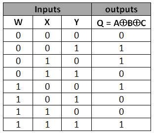

# kotlin-strives-for-dl
Repository to support my talk on [Kotlin](http://kotlinlang.org/) and [Artificial Neural Network](https://en.wikipedia.org/wiki/Artificial_neural_network) internals if to be more specific how to implement simple deep neural net manually.

Through the code [Koma](http://koma.kyonifer.com/) is used as a scientific computing library written in [Kotlin](http://kotlinlang.org/).

There are also an example with usage of [Komputation](https://github.com/aisummary/komputation) as a comprehensive neural network framework also written in [Kotlin](http://kotlinlang.org/).   

Goal
===========

The goal of this repository code is to demonstrate how *3 input XOR* (image below) operation can be solved with simple implementation of [Artificial Neural Network](https://en.wikipedia.org/wiki/Artificial_neural_network).



Usage
===========

To build and run the simplest implementation of Neural Network the only required is JDK 1.8+ installed rest will be done by Gradle.

```bash
    ./gradlew clean build
```

Another options is to use [Docker](https://www.docker.com/) and [Docker Compose](https://docs.docker.com/compose/) with [Beakerx](http://beakerx.com/) which brings support of [Jupyter](http://jupyter.org/) for [Kotlin](http://kotlinlang.org/) for that there is a need to execute next command.

```bash
    docker-compose up
```

After that there will be a log output (something like`http://localhost:8888/?token=88c602e4613ee87266265c7be3405329b7ef119460b3da00`) with an URL to open [Jupyter](http://jupyter.org/) in your browser. 